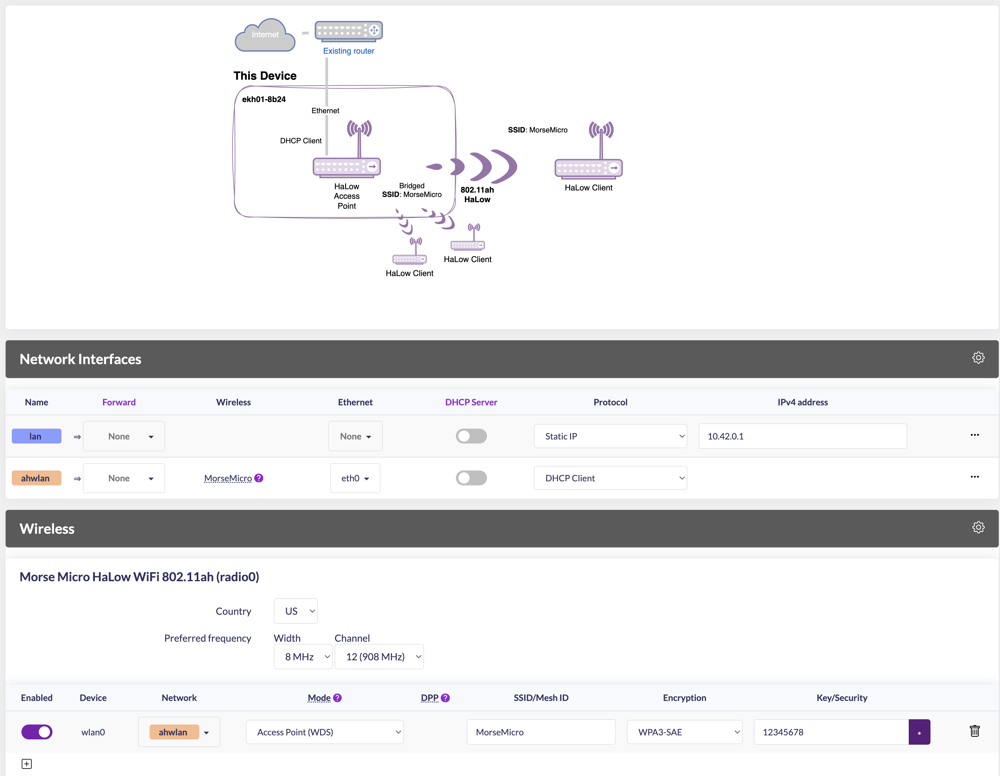
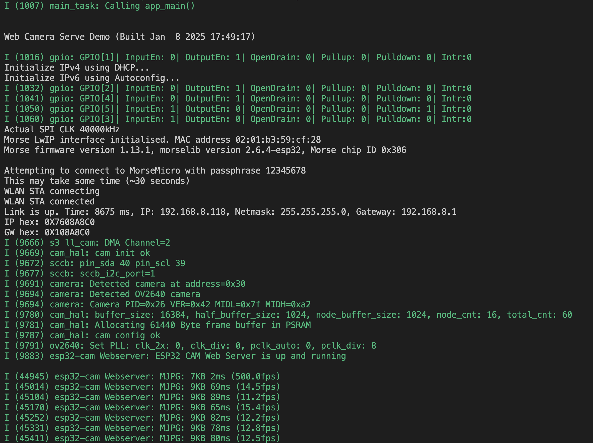
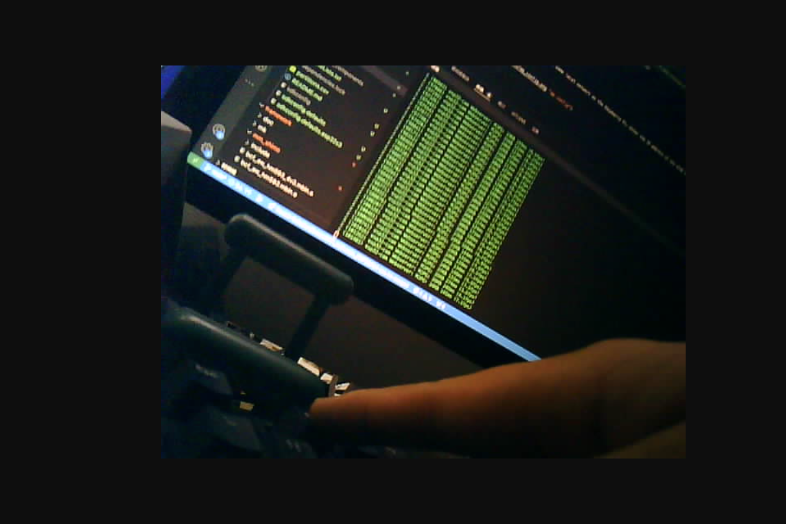

# Web Camera Serve
## Description

This is a demo showcasing the transmission of camera image streams via Wi-Fi HaLow.

## Usage

1. Set up the 'Raspberry Pi + HaLow module' as an AP and configure it in bridge mode. SSID: MorseMicro, Password: 12345678.



2. Compile this demo and flash it onto the XIAO ESP32S3 Sense.
   
```
export MMIOT_ROOT=../../
idf.py build flash monitor
```

3. Ensure your computer is on the same local network as the Raspberry Pi. Enter the IP address of the XIAO ESP32S3 in your browser.




